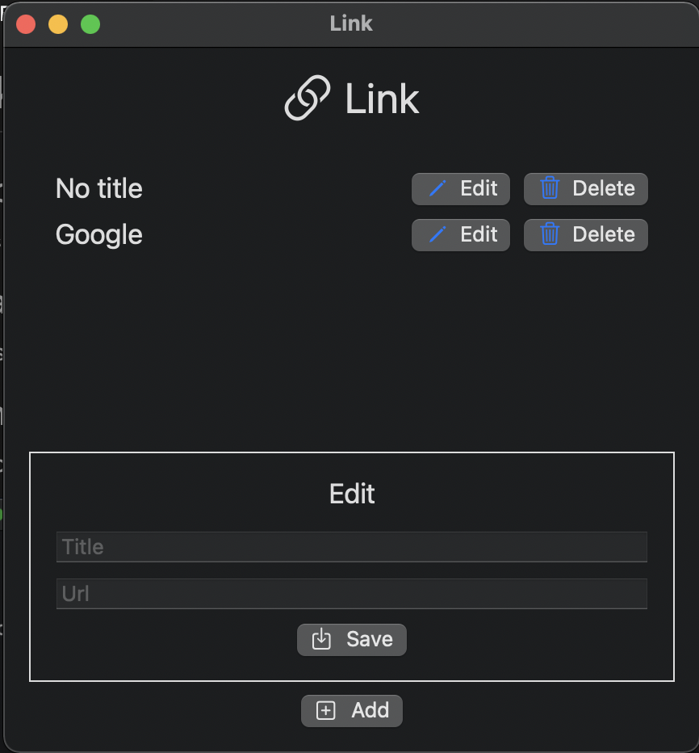

# Link

## Description
Link is a macos application for keeping important and complicated urls in one place.

## Prerequisites
- MacOS 12.1 or newer.
- Newest version of Xcode.

## Installation
Download [Link.app](https://github.com/johansolbakken/Link/releases) from Github.

## Usage

A simple interface for adding, editing and removing links. The menu bar gets a link icon which will bring the application to the front for easy access to the links that the user desire.

